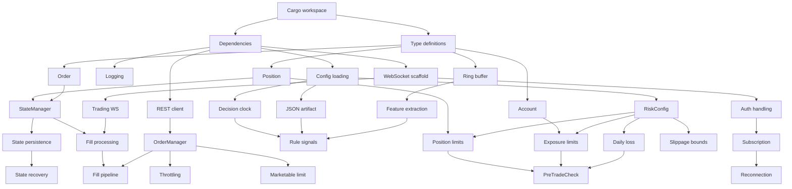

# Phase 2 Planning Document
## Production Execution + Safe Promotion

**Version:** 1.0
**Status:** Planning
**Target Duration:** 16 weeks (8 sprints)
**Start Date:** TBD (after Phase 1 completion)

---

## Table of Contents

1. [Executive Summary](#1-executive-summary)
2. [Rust Execution Engine Design](#2-rust-execution-engine-design)
3. [Control Plane Design](#3-control-plane-design)
4. [Sprint Plan](#4-sprint-plan)
5. [Task Tracking Table](#5-task-tracking-table)
6. [Integration Points](#6-integration-points)
7. [Risk Register](#7-risk-register)
8. [Testing Strategy](#8-testing-strategy)
9. [Definition of Done](#9-definition-of-done)

---

## 1. Executive Summary

### 1.1 Phase 2 Objectives

Phase 2 transitions the autonomous trading engine from research/paper-only (Python) to **production live execution** using a **Rust execution engine**. The primary goals are:

1. **Deterministic Execution**: Build a Rust-based execution engine that guarantees predictable, low-latency order handling
2. **Safe Live Trading**: Implement comprehensive pre-trade and post-trade risk controls
3. **Promotion Pipeline**: Establish Shadow -> Paper -> Canary -> Full promotion gates
4. **Artifact Contract**: Define clear Python-to-Rust interface for strategy artifacts (JSON/ONNX)
5. **Full Telemetry**: Comprehensive monitoring of latency, slippage, and system health

### 1.2 Success Criteria

| Criterion | Target | Measurement |
|-----------|--------|-------------|
| Order latency (p99) | < 50ms | End-to-end from signal to order submission |
| WebSocket reconnect | < 2s | Auto-recovery on disconnect |
| Kill switch response | < 100ms | Time to cancel all orders and halt |
| Artifact loading | < 500ms | Hot reload without restart |
| CPU fallback (ONNX) | 100% coverage | All models must run on CPU |
| Promotion gate pass rate | Documented | Per EVAL_PROTOCOL.md thresholds |
| Test coverage (Rust) | >= 80% | Unit + integration tests |
| Uptime (trading hours) | 99.9% | During market hours |

### 1.3 Key Deliverables

- [ ] `execution_engine_rs` - Rust execution runtime
- [ ] `control_plane` - Python API for strategy management
- [ ] Promotion gate automation (Shadow -> Paper -> Canary -> Full)
- [ ] Telemetry dashboard and alerting
- [ ] Operational runbooks
- [ ] Disaster recovery procedures

---

## 2. Rust Execution Engine Design

### 2.1 Architecture Overview

```
                    +------------------+
                    |  Control Plane   |
                    |    (Python)      |
                    +--------+---------+
                             |
                    gRPC / REST API
                             |
+----------------------------v-----------------------------+
|                    Execution Engine (Rust)               |
|  +---------------+  +---------------+  +---------------+ |
|  | Market Data   |  |    State      |  |   Signal      | |
|  |   Consumer    |  |   Manager     |  |  Generator    | |
|  +-------+-------+  +-------+-------+  +-------+-------+ |
|          |                  |                  |         |
|          v                  v                  v         |
|  +---------------+  +---------------+  +---------------+ |
|  |    Risk       |  |    Order      |  |    ONNX       | |
|  |   Engine      |  |   Manager     |  |   Inference   | |
|  +---------------+  +---------------+  +---------------+ |
+----------------------------------------------------------+
           |                    |
           v                    v
    +-----------+        +-----------+
    |  Alpaca   |        |  Alpaca   |
    |  Market   |        |  Trading  |
    | WebSocket |        | WebSocket |
    +-----------+        +-----------+
```

### 2.2 Core Modules

#### 2.2.1 Market Data Consumer (`market_data`)

**Responsibilities:**
- Connect to Alpaca market data WebSocket (trades, quotes, bars)
- Handle automatic reconnection with exponential backoff
- Maintain in-memory ring buffers for recent data
- Emit normalized events to signal generator

**Key Types:**
```rust
pub struct Trade {
    pub symbol: Symbol,
    pub ts_event: DateTime<Utc>,
    pub ts_recv: DateTime<Utc>,
    pub price: Decimal,
    pub size: Decimal,
    pub exchange: Exchange,
    pub conditions: Vec<TradeCondition>,
}

pub struct Quote {
    pub symbol: Symbol,
    pub ts_event: DateTime<Utc>,
    pub ts_recv: DateTime<Utc>,
    pub bid_price: Decimal,
    pub bid_size: Decimal,
    pub ask_price: Decimal,
    pub ask_size: Decimal,
}

pub struct MarketDataEvent {
    pub kind: MarketDataKind,
    pub latency_ns: u64,  // ts_recv - ts_event
}
```

**Configuration:**
```toml
[market_data]
feed_type = "iex"  # or "sip"
symbols = ["SPY", "QQQ", "AAPL"]
reconnect_base_delay_ms = 100
reconnect_max_delay_ms = 30000
buffer_size = 10000
```

#### 2.2.2 State Manager (`state`)

**Responsibilities:**
- Track current positions per symbol
- Track open orders and their states
- Maintain account equity and buying power
- Persist state snapshots for recovery
- Handle fills and position updates from trading WebSocket

**Key Types:**
```rust
pub struct Position {
    pub symbol: Symbol,
    pub qty: Decimal,
    pub avg_entry_price: Decimal,
    pub market_value: Decimal,
    pub unrealized_pnl: Decimal,
    pub cost_basis: Decimal,
}

pub struct Order {
    pub order_id: OrderId,
    pub client_order_id: ClientOrderId,
    pub symbol: Symbol,
    pub side: Side,
    pub qty: Decimal,
    pub filled_qty: Decimal,
    pub order_type: OrderType,
    pub time_in_force: TimeInForce,
    pub limit_price: Option<Decimal>,
    pub status: OrderStatus,
    pub submitted_at: DateTime<Utc>,
    pub filled_at: Option<DateTime<Utc>>,
}

pub struct AccountState {
    pub equity: Decimal,
    pub buying_power: Decimal,
    pub cash: Decimal,
    pub portfolio_value: Decimal,
    pub daily_pnl: Decimal,
}
```

#### 2.2.3 Signal Generator (`signal`)

**Responsibilities:**
- Load and execute promoted strategy artifacts
- Build features from market data on decision clock
- Generate trading signals (direction, size, confidence)
- Support both rule-based (JSON) and ML-based (ONNX) strategies

**Key Types:**
```rust
pub enum StrategyArtifact {
    RuleBased(RuleBasedStrategy),
    OnnxModel(OnnxStrategy),
}

pub struct Signal {
    pub symbol: Symbol,
    pub direction: Direction,  // Long, Short, Flat
    pub target_position: Decimal,
    pub confidence: f64,
    pub strategy_id: StrategyId,
    pub decision_ts: DateTime<Utc>,
    pub features_snapshot: FeaturesSnapshot,
}

pub struct DecisionClock {
    pub interval: Duration,  // e.g., 60 seconds
    pub last_tick: DateTime<Utc>,
    pub market_hours_only: bool,
}
```

#### 2.2.4 Risk Engine (`risk`)

**Responsibilities:**
- Pre-trade risk validation
- Position limits enforcement
- Exposure limits (gross/net)
- Daily loss limits
- Slippage bounds validation
- Kill switch implementation

**Risk Rules (Taker-Specific):**
```rust
pub struct RiskConfig {
    // Position limits
    pub max_position_qty: HashMap<Symbol, Decimal>,
    pub max_position_notional: Decimal,

    // Exposure limits
    pub max_gross_exposure: Decimal,
    pub max_net_exposure: Decimal,

    // Loss limits
    pub max_daily_loss: Decimal,
    pub max_single_trade_loss: Decimal,

    // Order constraints
    pub order_type: OrderTypePolicy,  // MarketableLimit only
    pub time_in_force: TifPolicy,     // IOC, FOK, DAY
    pub max_slippage_bps: u32,

    // Circuit breakers
    pub kill_switch_enabled: bool,
    pub auto_flatten_on_breach: bool,
}

pub struct PreTradeCheck {
    pub passed: bool,
    pub violations: Vec<RiskViolation>,
    pub adjusted_qty: Option<Decimal>,
}

pub enum RiskViolation {
    PositionLimitExceeded { symbol: Symbol, current: Decimal, limit: Decimal },
    ExposureLimitExceeded { gross: Decimal, limit: Decimal },
    DailyLossLimitExceeded { current: Decimal, limit: Decimal },
    SlippageBoundsExceeded { expected_bps: u32, limit_bps: u32 },
    KillSwitchActive,
}
```

**Kill Switch:**
```rust
pub struct KillSwitch {
    pub active: bool,
    pub triggered_at: Option<DateTime<Utc>>,
    pub triggered_by: Option<KillSwitchTrigger>,
}

pub enum KillSwitchTrigger {
    ManualActivation { operator: String },
    DailyLossLimit,
    SystemError { error: String },
    FeedDisconnect { duration: Duration },
    ApiRateLimit,
}

impl KillSwitch {
    /// Immediately cancel all open orders and halt new order submission
    pub async fn activate(&mut self, trigger: KillSwitchTrigger, order_manager: &OrderManager) {
        self.active = true;
        self.triggered_at = Some(Utc::now());
        self.triggered_by = Some(trigger);
        order_manager.cancel_all_orders().await;
        // Emit alert
    }
}
```

#### 2.2.5 Order Manager (`order`)

**Responsibilities:**
- Construct marketable limit orders
- Submit orders to Alpaca REST API
- Track order lifecycle via trading WebSocket
- Handle fills, partial fills, cancellations
- Implement order throttling

**Key Types:**
```rust
pub struct OrderRequest {
    pub symbol: Symbol,
    pub side: Side,
    pub qty: Decimal,
    pub order_type: OrderType,
    pub time_in_force: TimeInForce,
    pub limit_price: Decimal,
    pub client_order_id: ClientOrderId,
    pub strategy_id: StrategyId,
}

pub struct OrderResult {
    pub order_id: OrderId,
    pub status: OrderStatus,
    pub submitted_at: DateTime<Utc>,
    pub latency_ms: u64,
}

impl OrderManager {
    /// Submit a marketable limit order
    /// Buy: limit_price = ask + offset_bps
    /// Sell: limit_price = bid - offset_bps
    pub async fn submit_marketable_limit(
        &self,
        symbol: Symbol,
        side: Side,
        qty: Decimal,
        quote: &Quote,
        offset_bps: u32,
    ) -> Result<OrderResult, OrderError>;

    /// Cancel all open orders (for kill switch)
    pub async fn cancel_all_orders(&self) -> Result<Vec<CancelResult>, OrderError>;
}
```

#### 2.2.6 ONNX Inference (`inference`)

**Responsibilities:**
- Load ONNX models from artifacts
- Execute inference with feature vectors
- GPU inference (optional) with CPU fallback
- Model hot-reload without restart

**Key Types:**
```rust
pub struct OnnxRuntime {
    session: ort::Session,
    device: InferenceDevice,
    input_names: Vec<String>,
    output_names: Vec<String>,
    metadata: OnnxMetadata,
}

pub enum InferenceDevice {
    Cpu,
    Cuda { device_id: i32 },
}

pub struct OnnxMetadata {
    pub feature_schema_version: String,
    pub label_horizon_sec: u32,
    pub cost_model_version: String,
    pub risk_profile_id: String,
    pub inference_preferences: InferencePreferences,
}

pub struct InferencePreferences {
    pub prefer_gpu: bool,
    pub cpu_fallback: bool,
}

pub struct InferenceResult {
    pub expected_return: f64,
    pub confidence_score: f64,
    pub latency_us: u64,
    pub device_used: InferenceDevice,
}
```

### 2.3 Async Runtime Design (Tokio)

```rust
#[tokio::main]
async fn main() -> Result<(), Box<dyn std::error::Error>> {
    // Initialize components
    let config = Config::load()?;
    let state = Arc::new(RwLock::new(StateManager::new()));
    let risk = Arc::new(RiskEngine::new(config.risk.clone()));
    let orders = Arc::new(OrderManager::new(config.alpaca.clone()));

    // Spawn concurrent tasks
    let market_data_handle = tokio::spawn(market_data_task(state.clone()));
    let trading_ws_handle = tokio::spawn(trading_websocket_task(state.clone(), orders.clone()));
    let decision_handle = tokio::spawn(decision_loop_task(state.clone(), risk.clone(), orders.clone()));
    let telemetry_handle = tokio::spawn(telemetry_task());
    let control_handle = tokio::spawn(control_plane_server());

    // Wait for shutdown signal
    tokio::select! {
        _ = signal::ctrl_c() => {
            info!("Shutdown signal received");
        }
        _ = market_data_handle => {}
        _ = trading_ws_handle => {}
        _ = decision_handle => {}
    }

    // Graceful shutdown
    orders.cancel_all_orders().await?;
    Ok(())
}
```

### 2.4 WebSocket Handling

**Market Data WebSocket:**
```rust
pub struct MarketDataWebSocket {
    url: String,
    api_key: String,
    api_secret: String,
    subscriptions: Vec<Subscription>,
    reconnect_policy: ReconnectPolicy,
}

impl MarketDataWebSocket {
    pub async fn connect_and_subscribe(&mut self) -> Result<(), WsError> {
        loop {
            match self.try_connect().await {
                Ok(stream) => {
                    if let Err(e) = self.handle_stream(stream).await {
                        warn!("WebSocket error: {}", e);
                        self.reconnect_policy.wait().await;
                    }
                }
                Err(e) => {
                    error!("Connection failed: {}", e);
                    self.reconnect_policy.wait().await;
                }
            }
        }
    }
}
```

**Trading WebSocket:**
```rust
pub struct TradingWebSocket {
    url: String,
    api_key: String,
    api_secret: String,
    state: Arc<RwLock<StateManager>>,
}

impl TradingWebSocket {
    pub async fn handle_event(&self, event: TradingEvent) {
        match event {
            TradingEvent::Fill(fill) => {
                self.state.write().await.apply_fill(fill);
            }
            TradingEvent::OrderUpdate(update) => {
                self.state.write().await.update_order(update);
            }
            TradingEvent::TradeUpdate(update) => {
                self.state.write().await.update_position(update);
            }
        }
    }
}
```

### 2.5 Directory Structure

```
services/execution_engine_rs/
├── Cargo.toml
├── Cargo.lock
├── src/
│   ├── main.rs
│   ├── lib.rs
│   ├── config.rs
│   ├── market_data/
│   │   ├── mod.rs
│   │   ├── websocket.rs
│   │   ├── types.rs
│   │   └── buffer.rs
│   ├── state/
│   │   ├── mod.rs
│   │   ├── position.rs
│   │   ├── order.rs
│   │   └── account.rs
│   ├── signal/
│   │   ├── mod.rs
│   │   ├── artifact.rs
│   │   ├── rule_based.rs
│   │   └── decision_clock.rs
│   ├── risk/
│   │   ├── mod.rs
│   │   ├── pre_trade.rs
│   │   ├── limits.rs
│   │   └── kill_switch.rs
│   ├── order/
│   │   ├── mod.rs
│   │   ├── manager.rs
│   │   └── types.rs
│   ├── inference/
│   │   ├── mod.rs
│   │   ├── onnx.rs
│   │   └── device.rs
│   ├── telemetry/
│   │   ├── mod.rs
│   │   ├── metrics.rs
│   │   └── alerts.rs
│   └── api/
│       ├── mod.rs
│       └── grpc.rs
├── tests/
│   ├── integration/
│   │   ├── market_data_test.rs
│   │   ├── order_test.rs
│   │   └── risk_test.rs
│   └── unit/
│       ├── state_test.rs
│       └── signal_test.rs
└── benches/
    ├── inference_bench.rs
    └── signal_bench.rs
```

---

## 3. Control Plane Design

### 3.1 API Endpoints

```yaml
# Strategy Promotion
POST   /api/v1/strategies/{strategy_id}/promote
  body: { target_stage: "shadow|paper|canary|full", config: {} }
  response: { promotion_id, status, started_at }

POST   /api/v1/strategies/{strategy_id}/demote
  body: { reason: string }
  response: { demotion_id, previous_stage, current_stage }

GET    /api/v1/strategies/{strategy_id}/status
  response: { strategy_id, current_stage, metrics, health }

GET    /api/v1/strategies/active
  response: { strategies: [...] }

# Artifact Management
POST   /api/v1/artifacts/upload
  body: multipart { artifact: file, metadata: json }
  response: { artifact_id, version, validated: bool }

GET    /api/v1/artifacts/{artifact_id}
  response: { artifact_id, type, metadata, download_url }

POST   /api/v1/artifacts/{artifact_id}/validate
  response: { valid: bool, errors: [...] }

# Capital Allocation
PUT    /api/v1/allocation/{strategy_id}
  body: { notional: decimal, percentage: decimal }
  response: { allocation_id, effective_at }

GET    /api/v1/allocation
  response: { allocations: [...], total_deployed, available }

# Kill Switch
POST   /api/v1/kill-switch/activate
  body: { reason: string }
  response: { activated_at, orders_cancelled: int }

POST   /api/v1/kill-switch/deactivate
  body: { reason: string }
  response: { deactivated_at }

GET    /api/v1/kill-switch/status
  response: { active: bool, triggered_at, triggered_by }

# Configuration
PUT    /api/v1/config/risk
  body: { max_position, max_exposure, max_daily_loss, ... }
  response: { config_version, effective_at }

PUT    /api/v1/config/execution
  body: { order_type_policy, tif_policy, limit_offset_bps, ... }
  response: { config_version, effective_at }

PUT    /api/v1/config/gpu
  body: { inference_gpu_enabled: bool, device_id: int }
  response: { config_version, effective_at }

# Telemetry
GET    /api/v1/telemetry/metrics
  query: { start_time, end_time, granularity }
  response: { metrics: [...] }

GET    /api/v1/telemetry/health
  response: { status, components: {...} }
```

### 3.2 Promotion Workflow

```
+------------+     +------------+     +------------+     +------------+
|   Shadow   | --> |   Paper    | --> |   Canary   | --> |    Full    |
| (signals)  |     | (Alpaca    |     | (5-10%     |     | (100%      |
|            |     |  paper)    |     |  capital)  |     |  capital)  |
+------------+     +------------+     +------------+     +------------+
      |                  |                  |                  |
      v                  v                  v                  v
 Signal rate        Slippage <         MDD < 5%          Continuous
 within band        backtest +         Slippage <        monitoring
 Feature PSI        7 bps              paper + 5 bps
 < 0.2              Fill rate          No incidents
                    >= 95%
```

**Promotion State Machine:**
```python
class PromotionState(Enum):
    CANDIDATE = "candidate"
    SHADOW = "shadow"
    PAPER = "paper"
    CANARY = "canary"
    FULL = "full"
    RETIRED = "retired"
    ROLLED_BACK = "rolled_back"

class PromotionTransition:
    from_state: PromotionState
    to_state: PromotionState
    gate_checks: List[GateCheck]
    min_duration_days: int
```

### 3.3 Kill Switch Mechanism

**Trigger Conditions:**
1. Manual activation via API
2. Daily loss limit breach
3. System error (unrecoverable)
4. Market data feed disconnect > 30 seconds
5. Order reject rate > 5%
6. Slippage anomaly (p99 > 3x expected)

**Actions on Activation:**
1. Set `kill_switch.active = true`
2. Cancel all open orders (immediate)
3. Halt new signal generation
4. Optionally flatten all positions
5. Send alert to operators
6. Log trigger reason and state snapshot

**Recovery:**
1. Manual deactivation required
2. Health checks must pass
3. Operator confirmation
4. Gradual ramp-up (optional)

### 3.4 Control Plane Directory Structure

```
services/control_plane_py/
├── pyproject.toml
├── control_plane/
│   ├── __init__.py
│   ├── app.py
│   ├── api/
│   │   ├── __init__.py
│   │   ├── strategies.py
│   │   ├── artifacts.py
│   │   ├── allocation.py
│   │   ├── kill_switch.py
│   │   ├── config.py
│   │   └── telemetry.py
│   ├── services/
│   │   ├── __init__.py
│   │   ├── promotion.py
│   │   ├── artifact_validator.py
│   │   └── gate_checker.py
│   ├── clients/
│   │   ├── __init__.py
│   │   └── execution_engine.py  # gRPC client
│   └── models/
│       ├── __init__.py
│       ├── strategy.py
│       ├── artifact.py
│       └── allocation.py
└── tests/
    ├── test_promotion.py
    └── test_gate_checker.py
```

---

## 4. Sprint Plan

### Sprint Overview

| Sprint | Duration | Focus Area | Key Deliverables |
|--------|----------|------------|------------------|
| 1 | 2 weeks | Rust Project Setup & Market Data | Project scaffold, market data WebSocket |
| 2 | 2 weeks | State Management & Signal Generation | Position/order tracking, rule-based signals |
| 3 | 2 weeks | Risk Engine & Order Management | Pre-trade risk, order submission |
| 4 | 2 weeks | ONNX Inference & Artifact Loading | ML inference, hot reload |
| 5 | 2 weeks | Control Plane API | Promotion, config, kill switch APIs |
| 6 | 2 weeks | Promotion Gates (Shadow -> Paper) | Gate automation, metrics collection |
| 7 | 2 weeks | Canary Deployment & Telemetry | Canary pipeline, dashboards |
| 8 | 2 weeks | Full Live Readiness & Kill Switch | Production hardening, runbooks |

---

### Sprint 1: Rust Project Setup & Market Data Consumer

**Duration:** 2 weeks
**Goal:** Establish Rust project structure and implement market data ingestion

**Week 1:**
- [ ] Initialize Cargo workspace with dependencies
- [ ] Define core type definitions (trades, quotes, symbols)
- [ ] Implement configuration loading (TOML)
- [ ] Set up logging and error handling

**Week 2:**
- [ ] Implement Alpaca market data WebSocket client
- [ ] Handle authentication and subscription
- [ ] Implement reconnection with exponential backoff
- [ ] Create ring buffer for recent data
- [ ] Unit tests for data parsing

**Dependencies:**
- Alpaca API credentials (paper)
- WebSocket library selection (tokio-tungstenite)

**Exit Criteria:**
- Market data flowing from Alpaca WebSocket
- Reconnection tested and working
- Ring buffer maintaining last N events

---

### Sprint 2: State Management & Signal Generation

**Duration:** 2 weeks
**Goal:** Track positions/orders and generate signals from rule-based strategies

**Week 1:**
- [ ] Implement Position struct and operations
- [ ] Implement Order state machine
- [ ] Implement AccountState tracking
- [ ] Connect to trading WebSocket for updates
- [ ] State persistence/recovery

**Week 2:**
- [ ] Implement decision clock
- [ ] Load JSON strategy artifacts
- [ ] Implement rule-based signal generation
- [ ] Feature extraction from market data buffer
- [ ] Unit tests for state transitions

**Dependencies:**
- Sprint 1 complete (market data flowing)
- Sample JSON strategy artifact from Phase 1

**Exit Criteria:**
- State accurately reflects paper account
- Rule-based signals generated on decision clock
- State survives restart (recovery)

---

### Sprint 3: Risk Engine & Order Management

**Duration:** 2 weeks
**Goal:** Implement pre-trade risk checks and order submission

**Week 1:**
- [ ] Implement RiskConfig structure
- [ ] Implement position limit checks
- [ ] Implement exposure limit checks
- [ ] Implement daily loss limit tracking
- [ ] Implement slippage bounds validation

**Week 2:**
- [ ] Implement OrderManager with Alpaca REST
- [ ] Implement marketable limit order construction
- [ ] Implement order throttling
- [ ] Connect fills from trading WebSocket
- [ ] Integration tests with paper account

**Dependencies:**
- Sprint 2 complete (state management)
- Alpaca paper trading credentials

**Exit Criteria:**
- Pre-trade risk checks blocking violating orders
- Orders successfully submitted to Alpaca paper
- Fills correctly updating state

---

### Sprint 4: ONNX Inference & Artifact Loading

**Duration:** 2 weeks
**Goal:** Load and execute ONNX models with GPU support and CPU fallback

**Week 1:**
- [ ] Integrate ort (ONNX Runtime) crate
- [ ] Implement OnnxRuntime wrapper
- [ ] Implement feature vector construction
- [ ] Implement inference execution
- [ ] CPU inference validation

**Week 2:**
- [ ] Add GPU inference support (CUDA EP)
- [ ] Implement CPU fallback logic
- [ ] Implement artifact hot-reload
- [ ] Artifact validation (schema, version)
- [ ] Inference benchmarks

**Dependencies:**
- Sprint 3 complete (order management)
- Sample ONNX model from Phase 1 optimizer
- CUDA toolkit (optional for GPU)

**Exit Criteria:**
- ONNX models loaded and executed
- GPU inference working (where available)
- CPU fallback tested
- Hot-reload without restart

---

### Sprint 5: Control Plane API

**Duration:** 2 weeks
**Goal:** Build Python control plane with all management APIs

**Week 1:**
- [ ] Initialize control_plane_py project
- [ ] Implement strategy promotion endpoints
- [ ] Implement artifact management endpoints
- [ ] Implement allocation endpoints
- [ ] Database models for promotion state

**Week 2:**
- [ ] Implement kill switch endpoints
- [ ] Implement configuration endpoints
- [ ] Implement telemetry query endpoints
- [ ] gRPC client for execution engine
- [ ] API tests

**Dependencies:**
- Sprint 4 complete (execution engine MVP)
- Registry database from Phase 1

**Exit Criteria:**
- All API endpoints functional
- Control plane can communicate with execution engine
- Kill switch tested end-to-end

---

### Sprint 6: Promotion Gates (Shadow -> Paper)

**Duration:** 2 weeks
**Goal:** Automate Shadow and Paper promotion gates per EVAL_PROTOCOL.md

**Week 1:**
- [ ] Implement shadow mode (signals only, no orders)
- [ ] Implement signal rate monitoring
- [ ] Implement feature drift (PSI) calculation
- [ ] Implement feed integrity checks
- [ ] Shadow gate evaluation logic

**Week 2:**
- [ ] Implement paper gate metrics collection
- [ ] Implement slippage tracking
- [ ] Implement fill rate monitoring
- [ ] Implement daily loss tracking
- [ ] Gate pass/fail automation

**Dependencies:**
- Sprint 5 complete (control plane)
- EVAL_PROTOCOL.md thresholds

**Exit Criteria:**
- Shadow gate automated (5 trading days)
- Paper gate automated (10 trading days)
- Fail-fast conditions trigger rollback
- Metrics stored in registry

---

### Sprint 7: Canary Deployment & Telemetry

**Duration:** 2 weeks
**Goal:** Implement canary promotion gate and comprehensive telemetry

**Week 1:**
- [ ] Implement canary capital allocation (5-10%)
- [ ] Implement canary gate metrics
- [ ] Implement automatic rollback triggers
- [ ] Integrate with live Alpaca account

**Week 2:**
- [ ] Implement telemetry collection
  - [ ] Decision latency
  - [ ] WebSocket lag
  - [ ] Order latency
  - [ ] Slippage distributions
  - [ ] GPU inference latency
- [ ] Build telemetry dashboard
- [ ] Implement anomaly alerting

**Dependencies:**
- Sprint 6 complete (Shadow/Paper gates)
- Alpaca live credentials (small capital)
- Grafana/Prometheus setup

**Exit Criteria:**
- Canary deployment working with live capital
- Telemetry dashboard operational
- Alerts firing on anomalies
- Rollback tested

---

### Sprint 8: Full Live Readiness & Kill Switch

**Duration:** 2 weeks
**Goal:** Production hardening, runbooks, and disaster recovery

**Week 1:**
- [ ] Kill switch end-to-end testing
- [ ] Disaster recovery procedures
- [ ] Secrets management integration
- [ ] Systemd service files
- [ ] Health check endpoints

**Week 2:**
- [ ] Operational runbooks
- [ ] Load testing
- [ ] Security audit
- [ ] Documentation finalization
- [ ] Go-live checklist

**Dependencies:**
- All previous sprints complete
- Infrastructure provisioning

**Exit Criteria:**
- All DEFINITION_OF_DONE criteria met
- Runbooks reviewed and tested
- Security audit passed
- Go-live approval

---

## 5. Task Tracking Table

### Legend

- **Status:** `[ ]` Not Started, `[~]` In Progress, `[x]` Complete, `[!]` Blocked

### Sprint 1 Tasks

| Task ID | Description | Component | Sprint | Status | Dependencies |
|---------|-------------|-----------|--------|--------|--------------|
| P2-001 | Initialize Cargo workspace | execution_engine_rs | 1 | [ ] | - |
| P2-002 | Add core dependencies (tokio, serde, etc.) | execution_engine_rs | 1 | [ ] | P2-001 |
| P2-003 | Define Trade, Quote, Symbol types | market_data | 1 | [ ] | P2-001 |
| P2-004 | Implement Config struct (TOML loading) | config | 1 | [ ] | P2-002 |
| P2-005 | Set up tracing/logging | core | 1 | [ ] | P2-002 |
| P2-006 | Implement error types | core | 1 | [ ] | P2-001 |
| P2-007 | WebSocket client scaffolding | market_data | 1 | [ ] | P2-002 |
| P2-008 | Alpaca authentication handling | market_data | 1 | [ ] | P2-007 |
| P2-009 | Market data subscription logic | market_data | 1 | [ ] | P2-008 |
| P2-010 | Reconnection with exponential backoff | market_data | 1 | [ ] | P2-009 |
| P2-011 | Ring buffer for recent events | market_data | 1 | [ ] | P2-003 |
| P2-012 | Unit tests for data parsing | market_data | 1 | [ ] | P2-009 |
| P2-013 | Integration test with Alpaca paper | market_data | 1 | [ ] | P2-010 |

### Sprint 2 Tasks

| Task ID | Description | Component | Sprint | Status | Dependencies |
|---------|-------------|-----------|--------|--------|--------------|
| P2-014 | Define Position struct | state | 2 | [ ] | P2-003 |
| P2-015 | Define Order struct and state machine | state | 2 | [ ] | P2-003 |
| P2-016 | Define AccountState struct | state | 2 | [ ] | P2-003 |
| P2-017 | StateManager implementation | state | 2 | [ ] | P2-014, P2-015 |
| P2-018 | Trading WebSocket client | state | 2 | [ ] | P2-007 |
| P2-019 | Process fills from WebSocket | state | 2 | [ ] | P2-017, P2-018 |
| P2-020 | State persistence (snapshot) | state | 2 | [ ] | P2-017 |
| P2-021 | State recovery on startup | state | 2 | [ ] | P2-020 |
| P2-022 | DecisionClock implementation | signal | 2 | [ ] | P2-004 |
| P2-023 | JSON artifact loading | signal | 2 | [ ] | P2-004 |
| P2-024 | Rule-based signal generation | signal | 2 | [ ] | P2-022, P2-023 |
| P2-025 | Feature extraction from buffer | signal | 2 | [ ] | P2-011 |
| P2-026 | Unit tests for state transitions | state | 2 | [ ] | P2-017 |
| P2-027 | Integration test: state + signals | signal | 2 | [ ] | P2-024, P2-025 |

### Sprint 3 Tasks

| Task ID | Description | Component | Sprint | Status | Dependencies |
|---------|-------------|-----------|--------|--------|--------------|
| P2-028 | Define RiskConfig struct | risk | 3 | [ ] | P2-004 |
| P2-029 | Position limit checker | risk | 3 | [ ] | P2-014, P2-028 |
| P2-030 | Exposure limit checker | risk | 3 | [ ] | P2-016, P2-028 |
| P2-031 | Daily loss limit tracker | risk | 3 | [ ] | P2-016, P2-028 |
| P2-032 | Slippage bounds validator | risk | 3 | [ ] | P2-028 |
| P2-033 | PreTradeCheck aggregator | risk | 3 | [ ] | P2-029, P2-030, P2-031 |
| P2-034 | Alpaca REST client (orders) | order | 3 | [ ] | P2-002 |
| P2-035 | OrderManager implementation | order | 3 | [ ] | P2-034 |
| P2-036 | Marketable limit order construction | order | 3 | [ ] | P2-035 |
| P2-037 | Order throttling logic | order | 3 | [ ] | P2-035 |
| P2-038 | Fill processing pipeline | order | 3 | [ ] | P2-019, P2-035 |
| P2-039 | Unit tests for risk checks | risk | 3 | [ ] | P2-033 |
| P2-040 | Integration test: order submission | order | 3 | [ ] | P2-035, P2-038 |

### Sprint 4 Tasks

| Task ID | Description | Component | Sprint | Status | Dependencies |
|---------|-------------|-----------|--------|--------|--------------|
| P2-041 | Add ort (ONNX Runtime) dependency | inference | 4 | [ ] | P2-002 |
| P2-042 | OnnxRuntime wrapper | inference | 4 | [ ] | P2-041 |
| P2-043 | Feature vector builder | inference | 4 | [ ] | P2-025 |
| P2-044 | Inference execution | inference | 4 | [ ] | P2-042, P2-043 |
| P2-045 | CPU inference validation | inference | 4 | [ ] | P2-044 |
| P2-046 | CUDA Execution Provider setup | inference | 4 | [ ] | P2-041 |
| P2-047 | GPU inference implementation | inference | 4 | [ ] | P2-046 |
| P2-048 | CPU fallback logic | inference | 4 | [ ] | P2-045, P2-047 |
| P2-049 | Artifact hot-reload mechanism | signal | 4 | [ ] | P2-023, P2-042 |
| P2-050 | Artifact validation (schema check) | signal | 4 | [ ] | P2-049 |
| P2-051 | Inference benchmarks | inference | 4 | [ ] | P2-044, P2-047 |
| P2-052 | Integration test: ONNX signals | inference | 4 | [ ] | P2-044, P2-024 |

### Sprint 5 Tasks

| Task ID | Description | Component | Sprint | Status | Dependencies |
|---------|-------------|-----------|--------|--------|--------------|
| P2-053 | Initialize control_plane_py project | control_plane | 5 | [ ] | - |
| P2-054 | FastAPI app scaffolding | control_plane | 5 | [ ] | P2-053 |
| P2-055 | Database models (SQLAlchemy) | control_plane | 5 | [ ] | P2-053 |
| P2-056 | POST /strategies/{id}/promote | control_plane | 5 | [ ] | P2-054, P2-055 |
| P2-057 | POST /strategies/{id}/demote | control_plane | 5 | [ ] | P2-054, P2-055 |
| P2-058 | GET /strategies/active | control_plane | 5 | [ ] | P2-054, P2-055 |
| P2-059 | POST /artifacts/upload | control_plane | 5 | [ ] | P2-054 |
| P2-060 | POST /artifacts/{id}/validate | control_plane | 5 | [ ] | P2-059 |
| P2-061 | PUT /allocation/{strategy_id} | control_plane | 5 | [ ] | P2-054 |
| P2-062 | POST /kill-switch/activate | control_plane | 5 | [ ] | P2-054 |
| P2-063 | POST /kill-switch/deactivate | control_plane | 5 | [ ] | P2-062 |
| P2-064 | PUT /config/risk | control_plane | 5 | [ ] | P2-054 |
| P2-065 | PUT /config/gpu | control_plane | 5 | [ ] | P2-054 |
| P2-066 | gRPC client for execution engine | control_plane | 5 | [ ] | P2-054 |
| P2-067 | API tests | control_plane | 5 | [ ] | P2-056 - P2-065 |

### Sprint 6 Tasks

| Task ID | Description | Component | Sprint | Status | Dependencies |
|---------|-------------|-----------|--------|--------|--------------|
| P2-068 | Shadow mode (signals only) | execution_engine_rs | 6 | [ ] | P2-024 |
| P2-069 | Signal rate monitoring | telemetry | 6 | [ ] | P2-068 |
| P2-070 | Feature drift (PSI) calculator | telemetry | 6 | [ ] | P2-025 |
| P2-071 | Feed integrity checker | telemetry | 6 | [ ] | P2-010 |
| P2-072 | Shadow gate evaluation | control_plane | 6 | [ ] | P2-069, P2-070, P2-071 |
| P2-073 | Paper gate slippage tracker | telemetry | 6 | [ ] | P2-038 |
| P2-074 | Paper gate fill rate monitor | telemetry | 6 | [ ] | P2-038 |
| P2-075 | Paper gate daily loss tracker | telemetry | 6 | [ ] | P2-031 |
| P2-076 | Paper gate evaluation | control_plane | 6 | [ ] | P2-073, P2-074, P2-075 |
| P2-077 | Gate pass/fail automation | control_plane | 6 | [ ] | P2-072, P2-076 |
| P2-078 | Fail-fast rollback trigger | control_plane | 6 | [ ] | P2-077 |
| P2-079 | Integration test: Shadow gate | control_plane | 6 | [ ] | P2-072 |
| P2-080 | Integration test: Paper gate | control_plane | 6 | [ ] | P2-076 |

### Sprint 7 Tasks

| Task ID | Description | Component | Sprint | Status | Dependencies |
|---------|-------------|-----------|--------|--------|--------------|
| P2-081 | Canary capital allocator | control_plane | 7 | [ ] | P2-061 |
| P2-082 | Canary gate metrics | telemetry | 7 | [ ] | P2-073 - P2-075 |
| P2-083 | Canary rollback triggers | control_plane | 7 | [ ] | P2-078 |
| P2-084 | Live Alpaca integration | execution_engine_rs | 7 | [ ] | P2-034 |
| P2-085 | Decision latency telemetry | telemetry | 7 | [ ] | P2-022 |
| P2-086 | WebSocket lag telemetry | telemetry | 7 | [ ] | P2-010 |
| P2-087 | Order latency telemetry | telemetry | 7 | [ ] | P2-035 |
| P2-088 | Slippage distribution telemetry | telemetry | 7 | [ ] | P2-073 |
| P2-089 | GPU inference latency telemetry | telemetry | 7 | [ ] | P2-051 |
| P2-090 | Prometheus metrics exporter | telemetry | 7 | [ ] | P2-085 - P2-089 |
| P2-091 | Grafana dashboard | telemetry | 7 | [ ] | P2-090 |
| P2-092 | Anomaly alerting rules | telemetry | 7 | [ ] | P2-091 |
| P2-093 | Integration test: Canary gate | control_plane | 7 | [ ] | P2-081, P2-082 |

### Sprint 8 Tasks

| Task ID | Description | Component | Sprint | Status | Dependencies |
|---------|-------------|-----------|--------|--------|--------------|
| P2-094 | Kill switch end-to-end test | execution_engine_rs | 8 | [ ] | P2-062, P2-063 |
| P2-095 | Disaster recovery procedures | ops | 8 | [ ] | P2-021 |
| P2-096 | Secrets management (Vault/env) | ops | 8 | [ ] | P2-004 |
| P2-097 | Systemd service files | ops | 8 | [ ] | - |
| P2-098 | Health check endpoints | execution_engine_rs | 8 | [ ] | P2-054 |
| P2-099 | Runbook: Startup procedure | ops | 8 | [ ] | P2-097 |
| P2-100 | Runbook: Shutdown procedure | ops | 8 | [ ] | P2-097 |
| P2-101 | Runbook: Kill switch response | ops | 8 | [ ] | P2-094 |
| P2-102 | Runbook: Recovery from failure | ops | 8 | [ ] | P2-095 |
| P2-103 | Load testing | execution_engine_rs | 8 | [ ] | All |
| P2-104 | Security audit | security | 8 | [ ] | All |
| P2-105 | Documentation finalization | docs | 8 | [ ] | All |
| P2-106 | Go-live checklist | ops | 8 | [ ] | All |
| P2-107 | Phase 2 sign-off | milestone | 8 | [ ] | All |

---

## 6. Integration Points

### 6.1 Phase 1 -> Phase 2 Interfaces

| Interface | Phase 1 Component | Phase 2 Component | Data/Protocol |
|-----------|-------------------|-------------------|---------------|
| Strategy Artifacts | optimizer_py | execution_engine_rs | JSON/ONNX files |
| Feature Schema | feature_builder_py | signal module | decision_frame_v1 |
| Registry | registry_api_py | control_plane | PostgreSQL / REST |
| Backtest Metrics | backtester_py | gate evaluation | metrics.json |
| Risk Profiles | - | risk module | JSON config |

### 6.2 Artifact Contract

**JSON Strategy Artifact (from optimizer_py to execution_engine_rs):**
```json
{
  "artifact_version": "1.1",
  "strategy_id": "trend_5m_v3",
  "strategy_family": "trend",
  "feature_schema_version": "decision_frame_v1",
  "label_horizon_sec": 300,
  "cost_model_version": "cm_v1",
  "risk_profile_id": "rp_default",
  "symbols": ["SPY", "QQQ"],
  "decision_interval_sec": 60,
  "training_metadata": { ... },
  "signal_logic": { ... },
  "sizing": { ... },
  "execution": { ... }
}
```

**ONNX Artifact (from optimizer_py to execution_engine_rs):**
- Model file: `{strategy_id}.onnx`
- Metadata sidecar: `{strategy_id}.meta.json`
- Input order: 13 features (per PRD.md Section 10.2)
- Output: `expected_return`, `confidence_score`

### 6.3 Data Flow

```
                Phase 1 (Python)                    Phase 2 (Rust/Python)
+------------------------------------------+    +---------------------------+
|                                          |    |                           |
| ingestor_py -> lake/raw/                 |    | market_data (WebSocket)   |
|       |                                  |    |       |                   |
|       v                                  |    |       v                   |
| feature_builder_py -> lake/features/     |    | signal (features)         |
|       |                                  |    |       |                   |
|       v                                  |    |       v                   |
| labeler_py -> lake/labels/               |    | signal (rule/ONNX)        |
|       |                                  |    |       |                   |
|       v                                  |    |       v                   |
| backtester_py -> metrics                 |    | risk (pre-trade)          |
|       |                                  |    |       |                   |
|       v                                  |    |       v                   |
| optimizer_py -> artifacts/               |--->| order (Alpaca)            |
|       |                                  |    |       |                   |
|       v                                  |    |       v                   |
| registry_api_py <------------------------|<---| control_plane             |
|                                          |    |                           |
+------------------------------------------+    +---------------------------+
```

### 6.4 Registry Integration

Phase 2 extends the registry with:
- Promotion state tracking (shadow/paper/canary/full)
- Live performance metrics
- Rollback history
- Kill switch events

---

## 7. Risk Register

| Risk ID | Description | Likelihood | Impact | Mitigation | Owner |
|---------|-------------|------------|--------|------------|-------|
| R2-001 | Rust learning curve delays development | Medium | High | Pair programming, Rust expertise hiring, extensive docs | Tech Lead |
| R2-002 | WebSocket disconnects during trading hours | Medium | High | Exponential backoff, kill switch, redundant connections | Infra |
| R2-003 | ONNX inference latency exceeds budget | Low | Medium | CPU fallback, model optimization, inference benchmarks | ML Lead |
| R2-004 | Alpaca API rate limiting | Medium | Medium | Request throttling, backoff, caching | Dev Team |
| R2-005 | State desync between engine and Alpaca | Medium | Critical | Periodic reconciliation, audit logs, alerts | Dev Team |
| R2-006 | Kill switch fails to cancel orders | Low | Critical | Redundant cancel paths, circuit breaker, manual override | Dev Team |
| R2-007 | Feature drift undetected in live | Medium | High | PSI monitoring, automated alerts, shadow validation | Data Team |
| R2-008 | Slippage exceeds modeled expectations | Medium | High | Conservative limits, real-time monitoring, auto-rollback | Risk |
| R2-009 | GPU inference hardware failure | Low | Low | CPU fallback mandatory, health checks | Infra |
| R2-010 | Secrets exposure | Low | Critical | Vault integration, environment isolation, audit | Security |
| R2-011 | Deployment rollback fails | Low | High | Blue-green deployment, tested rollback procedure | DevOps |
| R2-012 | Insufficient test coverage | Medium | Medium | 80% coverage requirement, CI enforcement | QA |

### Risk Response Plan

**Critical Risks (R2-005, R2-006, R2-010):**
- Weekly review of mitigation status
- Automated testing of failure scenarios
- Documented escalation path
- Pre-go-live sign-off required

---

## 8. Testing Strategy

### 8.1 Unit Testing

**Rust (execution_engine_rs):**
- Target: 80% line coverage
- Framework: `#[cfg(test)]` with `cargo test`
- Mocking: `mockall` for trait mocks
- Focus areas:
  - State transitions
  - Risk calculations
  - Order construction
  - Feature extraction
  - Signal generation

**Python (control_plane):**
- Target: 85% line coverage
- Framework: pytest
- Mocking: pytest-mock, httpx mock
- Focus areas:
  - API endpoint validation
  - Gate evaluation logic
  - Database operations

### 8.2 Integration Testing

| Test Suite | Components | Environment | Frequency |
|------------|------------|-------------|-----------|
| Market Data | market_data + Alpaca WS | Paper | Daily CI |
| Order Flow | order + risk + Alpaca REST | Paper | Daily CI |
| Signal Pipeline | market_data + signal + state | Simulation | Daily CI |
| Control Plane | control_plane + execution_engine | Paper | Daily CI |
| Promotion Gates | All components | Paper | Weekly |

### 8.3 Simulation Testing

**Market Replay:**
- Replay historical market data through execution engine
- Compare signals with Phase 1 backtester output
- Validate state management accuracy

**Fault Injection:**
- WebSocket disconnect during order
- Alpaca API timeout
- Kill switch activation
- State recovery after crash

### 8.4 Performance Testing

| Metric | Target | Test Method |
|--------|--------|-------------|
| Signal generation latency | < 10ms | Benchmark with `criterion` |
| ONNX inference (CPU) | < 5ms | Benchmark with `criterion` |
| ONNX inference (GPU) | < 1ms | Benchmark with `criterion` |
| Order submission latency | < 50ms | Integration test with timing |
| Throughput (signals/sec) | > 100 | Load test |

### 8.5 Test Data

- Historical market data from Phase 1 lake
- Synthetic edge cases (gaps, spikes, illiquidity)
- Sample strategy artifacts (JSON and ONNX)

---

## 9. Definition of Done

### 9.1 Sprint Completion Criteria

Each sprint is complete when:
- [ ] All sprint tasks marked complete
- [ ] Unit tests pass (>= 80% coverage for new code)
- [ ] Integration tests pass
- [ ] Code reviewed and merged
- [ ] Documentation updated
- [ ] Demo to stakeholders

### 9.2 Phase 2 Completion Criteria

Phase 2 is complete when all of the following are true:

**Functional Requirements:**
- [ ] Rust execution engine processes market data in real-time
- [ ] Rule-based strategies generate signals correctly
- [ ] ONNX models execute with CPU fallback
- [ ] Pre-trade risk checks enforce all limits
- [ ] Orders submitted successfully to Alpaca
- [ ] Fills update state correctly
- [ ] Kill switch cancels all orders within 100ms
- [ ] Control plane APIs fully operational
- [ ] Promotion gates automated per EVAL_PROTOCOL.md

**Non-Functional Requirements:**
- [ ] Order latency p99 < 50ms
- [ ] WebSocket auto-reconnect < 2s
- [ ] Test coverage >= 80%
- [ ] All critical risks mitigated
- [ ] Security audit passed
- [ ] Documentation complete

**Operational Requirements:**
- [ ] Systemd services configured
- [ ] Telemetry dashboard operational
- [ ] Alerts configured and tested
- [ ] Runbooks written and tested
- [ ] Disaster recovery procedure documented
- [ ] Go-live checklist completed

**Validation Requirements:**
- [ ] Shadow gate passed (5+ trading days)
- [ ] Paper gate passed (10+ trading days)
- [ ] Canary deployment successful (10+ trading days)
- [ ] No critical incidents during validation

### 9.3 Go-Live Checklist

```markdown
## Pre-Go-Live Checklist

### Infrastructure
- [ ] Production Alpaca credentials configured
- [ ] Secrets management operational
- [ ] Systemd services enabled
- [ ] Log aggregation configured
- [ ] Metrics collection operational
- [ ] Alerting configured

### Validation
- [ ] Shadow gate metrics within thresholds
- [ ] Paper gate metrics within thresholds
- [ ] Canary deployment successful
- [ ] Kill switch tested in production environment
- [ ] Recovery procedure tested

### Documentation
- [ ] Runbooks reviewed by ops team
- [ ] Escalation contacts documented
- [ ] API documentation complete
- [ ] Architecture diagrams current

### Approval
- [ ] Tech lead sign-off
- [ ] Risk manager sign-off
- [ ] Operations sign-off
- [ ] Final review meeting completed
```

---

## Appendix A: Dependency Graph



---

## Appendix B: Configuration Reference

### execution_engine_rs config.toml

```toml
[general]
log_level = "info"
decision_interval_sec = 60
market_hours_only = true

[alpaca]
api_key_env = "ALPACA_API_KEY"
api_secret_env = "ALPACA_API_SECRET"
base_url = "https://paper-api.alpaca.markets"
data_url = "wss://stream.data.alpaca.markets"
trading_url = "wss://paper-api.alpaca.markets/stream"
feed_type = "iex"

[market_data]
symbols = ["SPY", "QQQ", "AAPL"]
buffer_size = 10000
reconnect_base_delay_ms = 100
reconnect_max_delay_ms = 30000

[risk]
max_position_notional = 50000.0
max_gross_exposure = 100000.0
max_net_exposure = 75000.0
max_daily_loss = 2000.0
max_slippage_bps = 20
kill_switch_enabled = true
auto_flatten_on_breach = false

[execution]
order_type = "marketable_limit"
limit_offset_bps = 2
time_in_force = "ioc"
max_orders_per_second = 10

[inference]
prefer_gpu = false
cpu_fallback = true
gpu_device_id = 0

[telemetry]
prometheus_port = 9090
metrics_interval_sec = 10
```

---

## Appendix C: Glossary

| Term | Definition |
|------|------------|
| **Artifact** | Strategy configuration (JSON) or ML model (ONNX) |
| **Canary** | Small capital live deployment (5-10%) for validation |
| **Decision Clock** | Fixed interval (e.g., 60s) at which signals are generated |
| **Gate** | Set of criteria that must pass before promotion |
| **Kill Switch** | Emergency mechanism to halt all trading immediately |
| **Marketable Limit** | Limit order priced to execute immediately (crossing spread) |
| **Paper** | Trading on Alpaca's simulated paper account |
| **PSI** | Population Stability Index (feature drift metric) |
| **Shadow** | Signal-only mode with no actual orders |
| **TIF** | Time In Force (IOC, FOK, DAY, etc.) |

---

*Document generated for autoBot Phase 2 Planning*
*Last updated: 2025-01-15*
